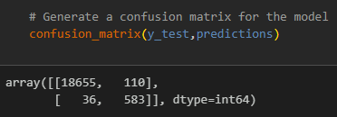
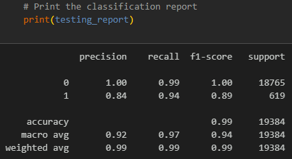

# credit-risk-classification

## Overview of the Analysis

* The purpose of this analysis was to use the provided dataset to predict whether a loan is healthy or at risk of defaulting, based on multiple credit-worthy factors of a borrower.
* The credit-worthy factors included loan size, interest rate, borrowers' income, debt-to-income ratio, number of accounts per borrower, derogatory marks (ex: late/missed payments, foreclosure, bankruptcy, etc.), and a borrower's total debt. This information is used to determine if a loan is in good standing or if it is at high risk of defaulting. This status is represented in binary, where 0 means a loan is in good standing, and 1 means a loan is high risk.
* To calculate the predictions, supervised machine learning techniques were used:
  * splitting into training and testing datasets;
  * logistics regression model;
  * validating the data score based on the logistics regression model;
  * make predictions;
  * calculate an accuracy score;
  * implement a confusion matrix and classification report to interpret the prediction results.

-----------------------------------

## Results

1. Separate the data into X (independent variable) and y (dependent variable).
    * X is the dataframe of independent variables that are the inputs and determine y.
    * y is an array that is the result/output of X.
2. Split the data into training and testing sets.
    * Using a train_test_split will take a random sampling of the provided data to train the model, and leave the remainder to test and validate the model.
    * train_test_split is used to help avoid overfitting the data, since training and then testing on the same data can lead to overfitting and poor performance.
3. Create a Logistic Regression model.
    * A logistic regression model can predict outcomes based on binary data outputs, such as for this case where 0 is a healthy loan, and 1 is a risk of defaulting.
    * The logistic regression model applied to the training data used lbfgs as the solver (typically the default solver), and iteration of 200 times (arbitrarily chosen), and a random_state = 1. Setting a random state reproduces the same train_test_split every time the model is run and helps keep the model consistent.
    * The training test score was validated by a score of 0.99293, which means that the prediction is likely to be highly accurate and precise.
4. Create predictions based on the testing data.
    * The classifier.predict() function was used to create predictions on the testing data set and an accuracy score was generated.
    * The accuracy score reflects on how often the model is correct, and in this case the accuracy score was 0.99247. Since this value is close to 1, this means that the predictions were correct almost 100% of the time.
    * The near-perfect accuracy shouldn't be the only validation since most of the data results in healthy loans and can cause an imbalance in what the machine looks for when predicting whether a loan is good or not.
5. Generate a confusion matrix.
    * The confusion matrix is a tool that helps visualize the predicted number of 0s and 1s from the dataset, and compare them to the actual number of 0s and 1s in the dataset. This assists in determining if the model was correctly trained to make predictions.
    * See figure 1 below for the resulting confusion matrix.
      
      
      
      Figure 1, Confusion Matrix
6. Generate a classification report.
    * The classification report is a matrix produced to view and compare the precision, recall, and accuracy scores for the two classes (0 and 1) in the model.
    * This report shows that he logistic regression model predicts the healthy loan (0) extremely well, with a precision = 1.00 and recall = 0.99. It also predicts the high-risk loan fairly well with precision = 0.84 and recall = 0.94, but less so than the healthy loan. See figure 2 for the resulting classification report.
      
      
      
      Figure 2, Classification Report
 
-----------------------------------

## Summary

Using a logistic regression model was suitable for the application of predicting whether a loan is healthy or at a high risk of defaulting, since those were the only two possible outcomes in the dataset. However it doesn't show how each independent (X) variable contributes to the output (y). Another model that would have worked well, and possibly even better, with this dataset is a decision tree, since a decision tree would show every step in the prediction process and how each independent variable factors into the output. This would be especially useful for finding the high-risk loans and making better decisions on whether a loan should be approved or not, since it would be much easier to delve into why a loan was rejected. It would also work the other way around in terms of finding out why a loan is deemed to be a less severe risk.

Overall, the logistic regression model predicts the healthy loan (0) extremely well, with a precision = 1.00 and recall = 0.99. It also predicts the high-risk loan fairly well with precision = 0.84 and recall = 0.94, but less so than the healthy loan. The precision and recall between '0' and '1' should be more similar than different. Part of the reason for this could be that the data is imbalanced with the majority of the data resulting in '0' rather than '1'. Another reason could be that there are not enough factors taken into account for determining loan status in this particular dataset, as well as the accuracy of the reported factors (were they submitted by the borrower, pulled from credit bureaus or government agencies, etc.).

------------------------------------

## Resources
* Module 20-1 activities and slides
* https://www.statology.org/sklearn-classification-report/
* https://datascience.stackexchange.com/questions/64441/how-to-interpret-classification-report-of-scikit-learn
* https://builtin.com/data-science/train-test-split
* Xpert Learning Assistant
